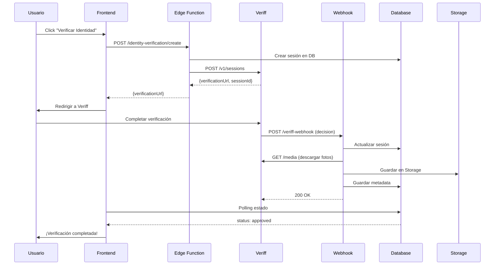

# 🚀 Veriff - Guía Rápida de Uso

## ✅ Todo Está Listo

El sistema de verificaciones de identidad con Veriff está **100% operativo** y listo para usar.

---

## 📦 ¿Qué Está Implementado?

### Backend ✅
- Schema `identity_verifications` con 7 tablas
- Edge Functions desplegadas (`veriff-webhook` + `identity-verification` + `veriff-sync`)
- Bucket de Storage configurado
- Veriff configurado para TuPatrimonio Platform
- Sincronización de sesiones externas disponible

### Frontend ✅
- Hook `useIdentityVerification` con todas las operaciones
- 3 componentes React listos para usar
- Tipos TypeScript completos
- Página de prueba en `/dashboard/test-verification`

---

## 🎯 Uso en 3 Pasos

### 1️⃣ Importa el Componente

```tsx
import { VerifyIdentityButton } from '@/components/signing/VerifyIdentityButton';
import { useOrganization } from '@/hooks/useOrganization';
```

### 2️⃣ Úsalo en tu Página

```tsx
export function MiPagina() {
  const { organization } = useOrganization();

  return (
    <VerifyIdentityButton
      params={{
        organizationId: organization.id,
        purpose: 'fes_signing',
        subjectIdentifier: '12345678-9',
        subjectEmail: 'usuario@ejemplo.com',
        subjectName: 'Juan Pérez',
      }}
    />
  );
}
```

### 3️⃣ ¡Eso es Todo!

El botón:
- ✅ Creará la sesión automáticamente
- ✅ Redirigirá al usuario a Veriff
- ✅ Procesará los resultados via webhook
- ✅ Descargará toda la evidencia
- ✅ Guardará todo para auditorías

---

## 🧪 Probar Ahora

1. **Inicia tu app de desarrollo:**
   ```bash
   npm run dev
   ```

2. **Ve a la página de prueba:**
   ```
   http://localhost:3000/dashboard/test-verification
   ```

3. **Completa el formulario y presiona "Verificar Identidad"**

4. **Serás redirigido a Veriff** donde deberás:
   - Tomar foto de tu documento (cédula/pasaporte)
   - Tomar un selfie
   - Completar el proceso (toma ~2 minutos)

5. **Los resultados se procesarán automáticamente**

---

## 🔧 Componentes Disponibles

### 1. `VerifyIdentityButton`
**Uso:** Botón simple para iniciar verificación

```tsx
<VerifyIdentityButton
  params={{...}}
  onVerificationStarted={(sessionId, url) => {
    // Callback cuando se crea la sesión
  }}
  variant="default"  // default | outline | secondary
  size="lg"          // sm | default | lg
/>
```

### 2. `VerificationStatusCard`
**Uso:** Card que muestra el estado de una verificación

```tsx
<VerificationStatusCard
  sessionId="session-uuid"
  autoRefresh={true}      // Actualiza automáticamente
  refreshInterval={5000}   // cada 5 segundos
  onStatusChange={(status) => {
    // Callback cuando cambia el estado
  }}
/>
```

### 3. `SignerVerificationPanel`
**Uso:** Panel completo para gestionar verificación de un firmante

```tsx
<SignerVerificationPanel
  signer={signer}
  organizationId={organization.id}
  documentId={document.id}
  purpose="fes_signing"
  requireVerification={true}
  onVerificationComplete={(sessionId) => {
    // Callback cuando se completa
  }}
/>
```

---

## 💡 Ejemplos de Integración

### Integrar en Flujo de Firmas FES

```tsx
// En tu componente de firma
import { SignerVerificationPanel } from '@/components/signing/SignerVerificationPanel';

export function FESSigningFlow({ document, signer }) {
  const [canSign, setCanSign] = useState(false);

  return (
    <div>
      {!canSign ? (
        <SignerVerificationPanel
          signer={signer}
          organizationId={document.organization_id}
          documentId={document.id}
          purpose="fes_signing"
          requireVerification={true}
          onVerificationComplete={() => setCanSign(true)}
        />
      ) : (
        <div>
          {/* Tu componente de firma aquí */}
          <h2>Listo para firmar</h2>
        </div>
      )}
    </div>
  );
}
```

### Verificar si Usuario Ya Está Verificado

```tsx
import { useIdentityVerification } from '@/hooks/useIdentityVerification';

const { isSessionValid } = useIdentityVerification();

// Verificar antes de mostrar documento
const checkBeforeSign = async (signerId: string) => {
  const isValid = await isSessionValid(signer.identity_verification_id);
  
  if (!isValid) {
    alert('Necesitas verificar tu identidad primero');
  } else {
    // Permitir firmar
  }
};
```

---

## 🔄 Flujo Completo



---

## 📊 Dashboard de Verificaciones

Para crear un dashboard completo, usa:

```tsx
import { useIdentityVerification } from '@/hooks/useIdentityVerification';

const { getStats } = useIdentityVerification();

const stats = await getStats(organizationId, startDate, endDate);

console.log(stats);
// {
//   total_sessions: 150,
//   approved: 142,
//   declined: 5,
//   pending: 3,
//   by_purpose: {
//     fes_signing: 120,
//     kyc_onboarding: 30
//   },
//   avg_risk_score: 15.2
// }
```

---

## 🆘 Troubleshooting

### "No hay configuración activa para el proveedor"

**Causa:** No se ejecutó el script de configuración.

**Solución:** Ejecuta el paso 3 y 4 del archivo que te proporcioné.

### "Error al crear sesión"

**Causa:** Credenciales incorrectas o Edge Function no desplegada.

**Solución:**
1. Verifica variables de entorno en Supabase Dashboard
2. Verifica que las funciones estén desplegadas:
   ```bash
   npx supabase functions list
   ```

### Usuario redirigido pero no aparece en Veriff

**Causa:** URL de Veriff no válida o sesión expirada.

**Solución:** Verifica los logs:
```bash
npx supabase functions logs identity-verification
```

---

## 📞 Siguiente Paso

**Prueba el sistema ahora:**

1. Ejecuta `npm run dev`
2. Ve a: `http://localhost:3000/dashboard/test-verification`
3. Completa el formulario
4. ¡Prueba una verificación real!

---

**Documentación Completa:**
- 📖 [IDENTITY-VERIFICATIONS.md](./IDENTITY-VERIFICATIONS.md) - Documentación técnica completa
- 💻 [FRONTEND-IDENTITY-VERIFICATION.md](./FRONTEND-IDENTITY-VERIFICATION.md) - Guía de frontend detallada
