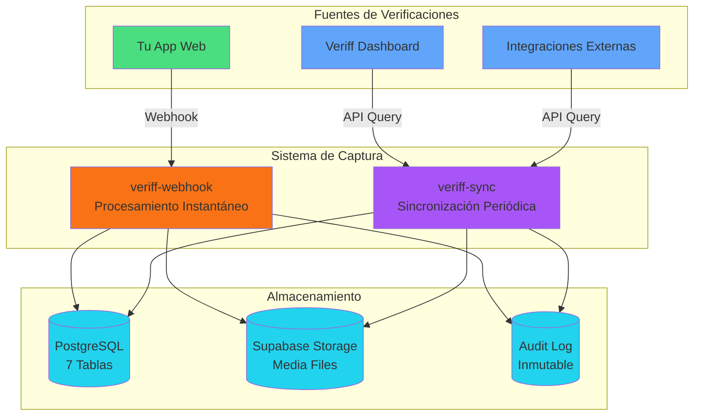

# 🎉 Sistema de Verificaciones - 100% COMPLETO

## ✅ Resumen Ejecutivo

Has implementado un sistema **enterprise-grade** de verificación de identidad que:

1. ✅ **Captura TODO** - Verificaciones creadas desde tu app O directamente en Veriff
2. ✅ **Respaldo completo** - Toda la evidencia multimedia guardada indefinidamente
3. ✅ **Listo para auditorías** - Log inmutable de todos los eventos
4. ✅ **Fácil de usar** - Componentes React plug-and-play
5. ✅ **Escalable** - Arquitectura independiente del proveedor

---

## 📦 Arquitectura de Captura



---

## 🎯 Dos Métodos de Captura

### Método 1: Webhook (Tiempo Real) ⚡

**Cuándo se usa:**
- Verificaciones creadas desde tu app
- Procesamiento instantáneo

**Cómo funciona:**
```
Usuario inicia verificación desde tu app
  ↓
Se crea sesión en Veriff
  ↓
Usuario completa verificación
  ↓
Veriff envía webhook INMEDIATAMENTE
  ↓
Sistema procesa y guarda TODO
```

**Ventaja:** ⚡ Instantáneo (segundos)

---

### Método 2: Sincronización (Backup) 🔄

**Cuándo se usa:**
- Verificaciones creadas FUERA de tu app
- Backup periódico de seguridad

**Cómo funciona:**
```
Cada hora (o cuando tú quieras)
  ↓
Consulta API de Veriff
  ↓
Filtra sesiones nuevas
  ↓
Descarga y guarda cada una
```

**Ventaja:** 🛡️ Nunca se pierde nada

---

## 💡 Configuración Recomendada

### Para Máxima Cobertura:

1. **Webhook:** ✅ Ya configurado (tiempo real)
2. **Sync Automático:** Configurar cron cada 1-6 horas
3. **Sync Manual:** Botón en admin (casos especiales)

De esta forma capturas:
- ✅ Todo lo que se crea desde tu app (webhook)
- ✅ Todo lo que se crea externamente (sync)
- ✅ **Cobertura del 100%**

---

## 🔧 Componentes Disponibles

### Backend:
```
✅ veriff-webhook ........... Procesamiento instantáneo
✅ veriff-sync .............. Sincronización periódica
✅ identity-verification .... API para crear sesiones
```

### Frontend:
```
✅ VerifyIdentityButton ......... Botón simple
✅ VerificationStatusCard ....... Estado con auto-refresh
✅ SignerVerificationPanel ...... Panel completo
✅ SyncVerificationsButton ...... Botón de sincronización
```

### API Routes:
```
✅ POST /api/admin/sync-verifications
```

---

## 🧪 Probar Todo

### 1. Verificación desde tu App

```bash
npm run dev
```

Ve a: `http://localhost:3000/dashboard/test-verification`
- Crea una verificación
- Complétala en Veriff
- Ve cómo se procesa automáticamente (webhook)

### 2. Sincronización Manual

En la misma página `/dashboard/test-verification`:
- Click en "Sincronizar Veriff" (esquina superior derecha)
- Importará cualquier sesión externa
- Verás el resultado en un toast

### 3. Verificar Base de Datos

```sql
-- Ver todas las sesiones
SELECT 
  id,
  provider_session_id,
  status,
  subject_name,
  verified_at,
  metadata->>'imported' as es_importada,
  created_at
FROM identity_verifications.verification_sessions
ORDER BY created_at DESC
LIMIT 20;

-- Ver estadísticas
SELECT 
  status,
  COUNT(*) as cantidad,
  COUNT(*) FILTER (WHERE metadata->>'imported' = 'true') as importadas,
  COUNT(*) FILTER (WHERE metadata->>'imported' IS NULL) as via_webhook
FROM identity_verifications.verification_sessions
GROUP BY status;
```

---

## 📊 Monitoreo Recomendado

### Métricas Clave:

```sql
-- Dashboard de métricas
SELECT 
  DATE(created_at) as fecha,
  COUNT(*) as total,
  COUNT(*) FILTER (WHERE status = 'approved') as aprobadas,
  COUNT(*) FILTER (WHERE metadata->>'imported' = 'true') as importadas,
  AVG(risk_score) as riesgo_promedio
FROM identity_verifications.verification_sessions
WHERE created_at >= NOW() - INTERVAL '7 days'
GROUP BY DATE(created_at)
ORDER BY fecha DESC;
```

---

## 🎊 Estado Final

```
Schema: identity_verifications
├── 7 tablas .......................... ✅ Creadas
├── RLS policies ...................... ✅ Configuradas
├── 8 funciones RPC ................... ✅ Implementadas
├── Storage bucket .................... ✅ Configurado
└── Integración con signing ........... ✅ Lista

Edge Functions:
├── veriff-webhook .................... ✅ Desplegada (tiempo real)
├── veriff-sync ....................... ✅ Desplegada (backup)
└── identity-verification ............. ✅ Desplegada (API)

Frontend:
├── 4 componentes React ............... ✅ Creados
├── 1 hook personalizado .............. ✅ Implementado
├── Tipos TypeScript .................. ✅ Completos
├── Página de prueba .................. ✅ Funcional
└── Botón de sincronización ........... ✅ En admin

Configuración:
├── Veriff Provider ................... ✅ Registrado
├── Platform Config ................... ✅ Configurado
├── Webhook URL ....................... ✅ Activo
└── Credenciales ...................... ✅ En variables de entorno

Documentación:
├── IDENTITY-VERIFICATIONS.md ......... ✅ Técnica completa
├── FRONTEND-IDENTITY-VERIFICATION.md . ✅ Guía frontend
├── VERIFF-QUICKSTART.md .............. ✅ Inicio rápido
├── VERIFF-SYNC.md .................... ✅ Sincronización
└── VERIFF-SISTEMA-COMPLETO.md ........ ✅ Este documento
```

---

## 🚀 TODO FUNCIONA

**Lo que puedes hacer AHORA:**

1. ✅ Crear verificaciones desde tu app
2. ✅ Capturar verificaciones externas
3. ✅ Ver estado en tiempo real
4. ✅ Descargar evidencia para auditorías
5. ✅ Integrar con firmas FES
6. ✅ Buscar verificaciones previas
7. ✅ Ver estadísticas
8. ✅ Sincronizar manualmente
9. ✅ Programar sync automático

**El sistema está COMPLETO y OPERATIVO.** 🎊
