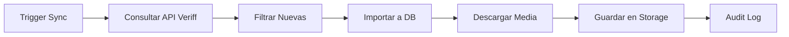

# 🔄 Sincronización de Verificaciones Externas

## 🎯 ¿Qué Problema Resuelve?

Si se crean verificaciones **fuera de tu aplicación**, por ejemplo:
- Directamente desde el Dashboard de Veriff
- Desde otra integración con Veriff
- Desde un enlace directo de Veriff

Esas verificaciones **NO** envían webhook a tu sistema automáticamente.

**Solución:** La función `veriff-sync` consulta la API de Veriff y descarga TODAS las sesiones que no estén en tu base de datos.

---

## ✅ Qué Hace la Sincronización



### Pasos Detallados:

1. **Consulta Veriff API** → GET /v1/sessions (últimas 100)
2. **Filtra sesiones nuevas** → Solo las que no están en tu DB
3. **Para cada sesión nueva:**
   - Obtiene datos completos (decision, person, document)
   - Crea registro en `verification_sessions`
   - Descarga fotos y videos
   - Guarda en Storage con checksums
   - Extrae datos del documento
   - Registra en audit log

---

## 🚀 Cómo Sincronizar

### Opción 1: Desde el Frontend (Manual) ⭐

Ya está implementado un botón en la página de prueba:

```
/dashboard/test-verification
```

Haz clic en **"Sincronizar Veriff"** en la esquina superior derecha.

El botón llama a:
```typescript
POST /api/admin/sync-verifications
```

### Opción 2: Desde la Terminal

```bash
# Con tu SERVICE_ROLE_KEY
curl -X POST https://tsefchkedlkwhiexqbrs.supabase.co/functions/v1/veriff-sync \
  -H "Authorization: Bearer eyJhbGc..."
```

### Opción 3: Programar Automáticamente (Cada Hora)

#### 3A. Usando Supabase Cron (Recomendado)

Ejecuta esto en el **SQL Editor de Supabase**:

```sql
-- Habilitar extensión pg_cron si no está habilitada
CREATE EXTENSION IF NOT EXISTS pg_cron;

-- Programar sincronización cada hora
SELECT cron.schedule(
  'sync-veriff-hourly',           -- Nombre del job
  '0 * * * *',                    -- Cada hora en punto
  $$
  SELECT net.http_post(
    url := 'https://tsefchkedlkwhiexqbrs.supabase.co/functions/v1/veriff-sync',
    headers := jsonb_build_object(
      'Authorization', 
      'Bearer ' || current_setting('app.settings.service_role_key')
    ),
    body := '{}'::jsonb
  ) AS request_id;
  $$
);

-- Ver jobs programados
SELECT * FROM cron.job;

-- Eliminar job si es necesario
SELECT cron.unschedule('sync-veriff-hourly');
```

#### 3B. Usando GitHub Actions

Crea `.github/workflows/sync-veriff.yml`:

```yaml
name: Sync Veriff Verifications

on:
  schedule:
    - cron: '0 * * * *'  # Cada hora
  workflow_dispatch:      # Permitir ejecución manual

jobs:
  sync:
    runs-on: ubuntu-latest
    steps:
      - name: Sync Verifications from Veriff
        run: |
          response=$(curl -s -w "\n%{http_code}" -X POST \
            https://tsefchkedlkwhiexqbrs.supabase.co/functions/v1/veriff-sync \
            -H "Authorization: Bearer ${{ secrets.SUPABASE_SERVICE_ROLE_KEY }}")
          
          http_code=$(echo "$response" | tail -n1)
          body=$(echo "$response" | head -n-1)
          
          echo "Response code: $http_code"
          echo "Response body: $body"
          
          if [ "$http_code" -ne 200 ]; then
            echo "❌ Sync failed"
            exit 1
          fi
          
          echo "✅ Sync completed"
```

Luego configura el secret `SUPABASE_SERVICE_ROLE_KEY` en:
- GitHub repo → Settings → Secrets and variables → Actions

#### 3C. Usando Vercel Cron

En `vercel.json`:

```json
{
  "crons": [
    {
      "path": "/api/admin/sync-verifications",
      "schedule": "0 * * * *"
    }
  ]
}
```

---

## 📊 Resultado de la Sincronización

Respuesta típica:

```json
{
  "success": true,
  "imported": 5,     // Sesiones nuevas importadas
  "skipped": 120,    // Sesiones que ya existían
  "errors": 0,       // Errores durante el proceso
  "total": 125       // Total de sesiones procesadas
}
```

---

## 🎯 Casos de Uso

### Caso 1: Verificaciones desde Veriff Dashboard

Si alguien usa el dashboard de Veriff directamente:
1. Crea una sesión manualmente
2. La sesión NO enviará webhook a tu app
3. **Solución:** Ejecutar sync capturará esa sesión

### Caso 2: Integraciones Externas

Si tienes otra app/sistema que también usa tu cuenta de Veriff:
1. Esa app crea sesiones
2. No están en tu base de datos
3. **Solución:** Sync las capturará y guardará

### Caso 3: Backup y Auditoría

Para asegurar que tienes **TODO** respaldado:
1. Ejecuta sync periódicamente (cada hora)
2. Capturas cualquier sesión que se haya perdido
3. **Garantía:** Backup completo para auditorías

### Caso 4: Integraciones con Credenciales Diferentes

Si tienes integraciones externas que usan **diferentes credenciales de Veriff** (API Key/Secret distintos a los principales):

1. **Configuración:** Agrega las credenciales secundarias en la tabla `identity_verification_provider_configs` columna `secondary_credentials`.
2. **Sincronización:** El sistema intentará descargar la media usando las credenciales principales.
3. **Fallback:** Si falla, probará automáticamente con cada set de credenciales secundarias hasta tener éxito.

---

## 🔐 Seguridad

### Permisos Requeridos

- ✅ Solo **Platform Admins** pueden ejecutar sync manual
- ✅ Solo **service_role** puede llamar la Edge Function directamente
- ✅ La función usa `SECURITY DEFINER` para bypass de RLS

### Asociación de Organizaciones

La función determina la organización así:

1. **Si la sesión tiene `vendorData`** → Usa ese UUID como organization_id
2. **Si NO tiene `vendorData`** → Usa TuPatrimonio Platform
3. **Marca como importada** → `metadata.imported = true`

---

## 📋 Monitoreo

### Ver Logs de Sincronización

```bash
# Ver logs de la función
npx supabase functions logs veriff-sync --tail
```

### Consultar Sesiones Importadas

```sql
-- Ver sesiones importadas por sync
SELECT 
  id,
  provider_session_id,
  status,
  subject_name,
  verified_at,
  metadata->>'imported_at' as imported_at
FROM identity_verifications.verification_sessions
WHERE metadata->>'imported' = 'true'
ORDER BY created_at DESC;
```

### Ver Audit Log de Sincronizaciones

```sql
-- Ver historial de sincronizaciones
SELECT 
  event_data->>'imported' as imported,
  event_data->>'skipped' as skipped,
  event_data->>'errors' as errors,
  event_data->>'total' as total,
  created_at
FROM identity_verifications.audit_log
WHERE event_type = 'sync_completed'
ORDER BY created_at DESC;
```

---

## 💡 Recomendaciones

### Para Producción:

1. **Configura Cron Job** → Sincronización automática cada hora
2. **Monitorea logs** → Revisa errores periódicamente
3. **Alertas** → Si `errors > 0`, recibir notificación
4. **Backup manual** → Botón en admin para casos especiales

### Frecuencia Recomendada:

- **Cada 1 hora** → Si usas mucho Veriff directamente
- **Cada 6 horas** → Si casi todo se crea desde tu app
- **Diaria** → Si solo necesitas backup de seguridad
- **Manual** → Si casi nunca se crean sesiones externas

---

## 🐛 Troubleshooting

### "Bundle generation timed out"

**Causa:** Las Edge Functions son muy pesadas.

**Solución:** Ya está resuelto, las funciones usan versiones optimizadas de dependencias.

### "No se encontraron sesiones nuevas"

**Causa:** Todo está sincronizado o no hay sesiones recientes.

**Resultado esperado:** `imported: 0, skipped: X`

### "Error consultando API de Veriff"

**Causa:** API Key incorrecta o problema de red.

**Solución:**
1. Verifica `VERIFF_API_KEY` en variables de entorno
2. Verifica que la API Key esté activa en Veriff Dashboard

---

## ✅ Checklist

- [x] Edge Function `veriff-sync` creada
- [x] API Route `/api/admin/sync-verifications` creada
- [x] Componente `SyncVerificationsButton` creado
- [x] Botón agregado a página de prueba
- [ ] Configurar Cron Job (opcional)
- [ ] Probar sincronización manual
- [ ] Monitorear logs de sincronización

---

**Con esto, tu sistema captura TODAS las verificaciones, sin importar dónde se hayan creado. ✅**
