# Diagrama del Schema Core - TuPatrimonio

## 📊 Diagrama Visual Completo - Flowchart

```mermaid
flowchart TD
    %% ============================================
    %% ENTIDADES PRINCIPALES (Núcleo del Sistema)
    %% ============================================
    
    ORG[organizations<br/>🏢 Multi-Tenant Base]
    USR[users<br/>👤 Usuarios del Sistema]
    ROL[roles<br/>🎭 Sistema de Roles]
    
    %% ============================================
    %% RELACIONES PRINCIPALES
    %% ============================================
    
    ORG_USR[organization_users<br/>🔗 Usuario-Organización]
    TEAMS[teams<br/>👥 Equipos]
    TEAM_MEM[team_members<br/>👤 Miembros]
    
    %% ============================================
    %% APLICACIONES Y SUSCRIPCIONES
    %% ============================================
    
    APPS[applications<br/>📱 Catálogo de Apps]
    ORG_APPS[organization_applications<br/>⚙️ Apps Habilitadas]
    PLANS[subscription_plans<br/>💳 Planes de Suscripción]
    ORG_SUBS[organization_subscriptions<br/>📅 Suscripciones Activas]
    
    %% ============================================
    %% INVITACIONES Y ACCESOS
    %% ============================================
    
    INV[invitations<br/>✉️ Invitaciones]
    API_KEYS[api_keys<br/>🔑 Claves API]
    
    %% ============================================
    %% SISTEMA Y NOTIFICACIONES
    %% ============================================
    
    EVENTS[system_events<br/>📊 Auditoría]
    NOTIF[notifications<br/>🔔 Notificaciones]
    
    %% ============================================
    %% RELACIONES: ORGANIZATIONS
    %% ============================================
    
    ORG -->|tiene usuarios| ORG_USR
    ORG -->|contiene| TEAMS
    ORG -->|habilita| ORG_APPS
    ORG -->|suscribe| ORG_SUBS
    ORG -->|invita| INV
    ORG -->|genera| API_KEYS
    ORG -->|registra| EVENTS
    ORG -->|recibe| NOTIF
    
    %% ============================================
    %% RELACIONES: USERS
    %% ============================================
    
    USR -->|pertenece a| ORG_USR
    USR -->|lidera| TEAMS
    USR -->|es miembro| TEAM_MEM
    USR -->|invita| INV
    USR -->|acepta| INV
    USR -->|crea| API_KEYS
    USR -->|genera| EVENTS
    USR -->|recibe| NOTIF
    
    %% ============================================
    %% RELACIONES: ROLES
    %% ============================================
    
    ROL -->|asigna| ORG_USR
    ROL -->|ofrece| INV
    ROL -->|hereda de| ROL
    
    %% ============================================
    %% RELACIONES: APLICACIONES
    %% ============================================
    
    APPS -->|se habilitan| ORG_APPS
    
    %% ============================================
    %% RELACIONES: PLANES
    %% ============================================
    
    PLANS -->|se suscriben| ORG_SUBS
    
    %% ============================================
    %% RELACIONES: EQUIPOS
    %% ============================================
    
    TEAMS -->|tiene miembros| TEAM_MEM
    
    %% ============================================
    %% ESTILOS
    %% ============================================
    
    classDef coreEntity fill:#800039,stroke:#a50049,stroke-width:3px,color:#fff
    classDef relation fill:#4a4a4a,stroke:#7a7a7a,stroke-width:2px,color:#fff
    classDef feature fill:#2d5aa0,stroke:#3d6ab0,stroke-width:2px,color:#fff
    classDef system fill:#5a5a5a,stroke:#7a7a7a,stroke-width:2px,color:#fff
    
    class ORG,USR,ROL coreEntity
    class ORG_USR,TEAMS,TEAM_MEM relation
    class APPS,ORG_APPS,PLANS,ORG_SUBS,INV,API_KEYS feature
    class EVENTS,NOTIF system
```



## 📊 Diagrama Detallado con Campos Principales

```mermaid
flowchart TD
    %% ============================================
    %% ORGANIZATIONS - Entidad Base
    %% ============================================
    
    ORG[organizations<br/>id: UUID PK<br/>name, slug UK<br/>status: enum<br/>email, phone<br/>settings: JSONB]
    
    %% ============================================
    %% USERS - Extensión de Auth
    %% ============================================
    
    USR[users<br/>id: UUID PK → auth.users<br/>first_name, last_name<br/>full_name: GENERATED<br/>status: enum<br/>preferences: JSONB]
    
    %% ============================================
    %% ROLES - Sistema Jerárquico
    %% ============================================
    
    ROL[roles<br/>id: UUID PK<br/>name, slug UK<br/>parent_role_id: FK<br/>level: integer<br/>permissions: JSONB<br/>is_system: boolean]
    
    %% ============================================
    %% RELACIONES PRINCIPALES
    %% ============================================
    
    ORG_USR[organization_users<br/>id: UUID PK<br/>organization_id: FK<br/>user_id: FK<br/>role_id: FK<br/>status: enum<br/>additional_permissions: JSONB]
    
    TEAMS[teams<br/>id: UUID PK<br/>organization_id: FK<br/>name, description<br/>lead_user_id: FK<br/>settings: JSONB]
    
    TEAM_MEM[team_members<br/>id: UUID PK<br/>team_id: FK<br/>user_id: FK<br/>team_role: enum]
    
    %% ============================================
    %% APLICACIONES
    %% ============================================
    
    APPS[applications<br/>id: UUID PK<br/>name, slug UK<br/>category: enum<br/>version, api_endpoint<br/>config_schema: JSONB]
    
    ORG_APPS[organization_applications<br/>id: UUID PK<br/>organization_id: FK<br/>application_id: FK<br/>config: JSONB<br/>is_enabled: boolean]
    
    %% ============================================
    %% SUSCRIPCIONES
    %% ============================================
    
    PLANS[subscription_plans<br/>id: UUID PK<br/>name, slug UK<br/>price_monthly/yearly<br/>features: JSONB<br/>limits: JSONB]
    
    ORG_SUBS[organization_subscriptions<br/>id: UUID PK<br/>organization_id: FK<br/>plan_id: FK<br/>status: enum<br/>stripe_subscription_id<br/>usage_data: JSONB]
    
    %% ============================================
    %% INVITACIONES Y ACCESOS
    %% ============================================
    
    INV[invitations<br/>id: UUID PK<br/>organization_id: FK<br/>role_id: FK<br/>email, token UK<br/>status: enum<br/>expires_at]
    
    API_KEYS[api_keys<br/>id: UUID PK<br/>organization_id: FK<br/>key_hash UK<br/>scopes: array<br/>permissions: JSONB<br/>rate_limit_per_hour]
    
    %% ============================================
    %% SISTEMA
    %% ============================================
    
    EVENTS[system_events<br/>id: UUID PK<br/>organization_id: FK nullable<br/>event_type, event_level<br/>user_id: FK nullable<br/>metadata: JSONB]
    
    NOTIF[notifications<br/>id: UUID PK<br/>organization_id: FK<br/>user_id: FK nullable<br/>type, status: enum<br/>title, message<br/>metadata: JSONB]
    
    %% ============================================
    %% FLUJOS PRINCIPALES
    %% ============================================
    
    ORG -->|1:N| ORG_USR
    USR -->|N:M| ORG_USR
    ROL -->|1:N| ORG_USR
    
    ORG -->|1:N| TEAMS
    USR -->|1:N| TEAMS
    TEAMS -->|1:N| TEAM_MEM
    USR -->|N:M| TEAM_MEM
    
    ORG -->|1:N| ORG_APPS
    APPS -->|1:N| ORG_APPS
    
    ORG -->|1:N| ORG_SUBS
    PLANS -->|1:N| ORG_SUBS
    
    ORG -->|1:N| INV
    ROL -->|1:N| INV
    USR -->|1:N| INV
    
    ORG -->|1:N| API_KEYS
    USR -->|1:N| API_KEYS
    
    ORG -->|1:N| EVENTS
    USR -->|1:N| EVENTS
    
    ORG -->|1:N| NOTIF
    USR -->|1:N| NOTIF
    
    ROL -->|auto-ref| ROL
    
    %% ============================================
    %% ESTILOS
    %% ============================================
    
    classDef coreEntity fill:#800039,stroke:#a50049,stroke-width:3px,color:#fff
    classDef relation fill:#4a4a4a,stroke:#7a7a7a,stroke-width:2px,color:#fff
    classDef feature fill:#2d5aa0,stroke:#3d6ab0,stroke-width:2px,color:#fff
    classDef system fill:#5a5a5a,stroke:#7a7a7a,stroke-width:2px,color:#fff
    
    class ORG,USR,ROL coreEntity
    class ORG_USR,TEAMS,TEAM_MEM relation
    class APPS,ORG_APPS,PLANS,ORG_SUBS,INV,API_KEYS feature
    class EVENTS,NOTIF system
```



## 🔄 Diagrama de Flujos de Trabajo Principales

```mermaid
flowchart TD
    %% ============================================
    %% FLUJO 1: Creación de Organización
    %% ============================================
    
    START1[Usuario se Registra] -->|Crea| ORG1[Organización]
    ORG1 -->|Asigna| ROLE1{Rol Inicial}
    ROLE1 -->|Owner| ORG_USR1[Usuario en Organización]
    ORG1 -->|Selecciona| PLAN1[Plan de Suscripción]
    PLAN1 -->|Crea| SUB1[Suscripción Activa]
    
    %% ============================================
    %% FLUJO 2: Invitación de Usuario
    %% ============================================
    
    START2[Admin Invita Usuario] -->|Crea| INV2[Invitación]
    INV2 -->|Ofrece| ROLE2[Rol]
    INV2 -->|Token único| EMAIL2[Email al Usuario]
    EMAIL2 -->|Acepta| ACCEPT2{Usuario Acepta}
    ACCEPT2 -->|Crea| ORG_USR2[Usuario en Organización]
    ACCEPT2 -->|Actualiza| INV2
    
    %% ============================================
    %% FLUJO 3: Habilitación de Aplicación
    %% ============================================
    
    START3[Admin Habilita App] -->|Selecciona| APP3[Aplicación Disponible]
    APP3 -->|Crea| ORG_APP3[App Habilitada]
    ORG_APP3 -->|Configura| CONFIG3{Configuración}
    CONFIG3 -->|JSONB| READY3[App Lista para Usar]
    
    %% ============================================
    %% FLUJO 4: Gestión de Equipos
    %% ============================================
    
    START4[Admin Crea Equipo] -->|Crea| TEAM4[Equipo]
    TEAM4 -->|Asigna| LEAD4[Líder del Equipo]
    LEAD4 -->|Agrega| MEMBERS4[Miembros]
    MEMBERS4 -->|Crea| TEAM_MEM4[Relación Miembro]
    
    %% ============================================
    %% FLUJO 5: Generación de API Key
    %% ============================================
    
    START5[Usuario Genera API Key] -->|Crea| API5[API Key]
    API5 -->|Hash seguro| STORE5[Almacena Hash]
    API5 -->|Prefijo visible| SHOW5[Muestra Prefijo]
    API5 -->|Scopes| PERMS5[Permisos Asignados]
    
    %% ============================================
    %% FLUJO 6: Sistema de Auditoría
    %% ============================================
    
    ACTION6[Acción del Usuario] -->|Genera| EVENT6[System Event]
    EVENT6 -->|Registra| META6[Metadata JSONB]
    EVENT6 -->|Nivel| LEVEL6{info|warning|error|critical}
    LEVEL6 -->|Almacena| LOG6[Audit Log]
    
    %% ============================================
    %% ESTILOS
    %% ============================================
    
    classDef start fill:#800039,stroke:#a50049,stroke-width:3px,color:#fff
    classDef process fill:#2d5aa0,stroke:#3d6ab0,stroke-width:2px,color:#fff
    classDef decision fill:#f7b731,stroke:#f39c12,stroke-width:2px,color:#000
    classDef end fill:#27ae60,stroke:#2ecc71,stroke-width:2px,color:#fff
    
    class START1,START2,START3,START4,START5,ACTION6 start
    class ORG1,ORG_USR1,PLAN1,SUB1,INV2,ORG_USR2,APP3,ORG_APP3,TEAM4,LEAD4,API5,EVENT6 process
    class ROLE1,ACCEPT2,CONFIG3,LEVEL6 decision
    class READY3,TEAM_MEM4,SHOW5,LOG6 end
```

## 📋 Descripción de Entidades

### 🏢 **organizations** - Organizaciones Multi-Tenant
**Propósito**: Entidad base del sistema multi-tenant. Cada organización es un tenant independiente.

**Campos Clave**:
- `id`: Identificador único UUID
- `slug`: Identificador único legible (ej: "mi-empresa")
- `status`: Estado de la organización (trial, active, inactive, suspended)
- `settings`: Configuración flexible en JSONB

**Relaciones**:
- Tiene múltiples usuarios (`organization_users`)
- Contiene equipos (`teams`)
- Habilita aplicaciones (`organization_applications`)
- Tiene suscripciones (`organization_subscriptions`)

---

### 👤 **users** - Usuarios del Sistema
**Propósito**: Extensión de `auth.users` de Supabase con información de perfil adicional.

**Campos Clave**:
- `id`: Referencia directa a `auth.users(id)`
- `full_name`: Campo generado automáticamente desde `first_name` + `last_name`
- `status`: Estado del usuario
- `preferences`: Preferencias de usuario (tema, notificaciones) en JSONB
- `last_active_organization_id`: Última organización activa del usuario

**Relaciones**:
- Pertenece a organizaciones (`organization_users`)
- Puede liderar equipos (`teams.lead_user_id`)
- Puede ser miembro de equipos (`team_members`)

---

### 🎭 **roles** - Sistema de Roles Jerárquico
**Propósito**: Define roles con permisos flexibles y herencia jerárquica.

**Campos Clave**:
- `slug`: Identificador único del rol (ej: "admin", "member")
- `parent_role_id`: Referencia a rol padre para herencia
- `level`: Nivel jerárquico (0-10)
- `permissions`: Permisos en formato JSONB flexible
- `is_system`: Indica si es un rol del sistema (no se puede eliminar)

**Relaciones**:
- Se asigna a usuarios en organizaciones (`organization_users`)
- Se ofrece en invitaciones (`invitations`)
- Puede tener roles hijos (auto-referencia)

---

### 🔗 **organization_users** - Relación Usuario-Organización
**Propósito**: Tabla de relación M:N entre usuarios y organizaciones con roles.

**Campos Clave**:
- `organization_id` + `user_id`: Clave única compuesta
- `role_id`: Rol asignado en esta organización
- `status`: Estado del usuario en esta organización
- `additional_permissions`: Permisos adicionales específicos de la organización

**Nota**: Un usuario puede pertenecer a múltiples organizaciones con diferentes roles.

---

### 👥 **teams** - Equipos dentro de Organizaciones
**Propósito**: Agrupa usuarios en equipos dentro de una organización.

**Campos Clave**:
- `name`: Nombre del equipo (único por organización)
- `lead_user_id`: Usuario líder del equipo
- `color`: Color identificador en formato hex
- `settings`: Configuración del equipo en JSONB

**Relaciones**:
- Pertenece a una organización
- Tiene miembros (`team_members`)

---

### 👤 **team_members** - Miembros de Equipos
**Propósito**: Relación entre usuarios y equipos.

**Campos Clave**:
- `team_id` + `user_id`: Clave única compuesta
- `team_role`: Rol dentro del equipo (member, lead, admin)
- `added_by`: Usuario que agregó al miembro

---

### 📱 **applications** - Catálogo de Aplicaciones
**Propósito**: Define las aplicaciones/servicios disponibles en el ecosistema.

**Campos Clave**:
- `slug`: Identificador único (ej: "crm", "signatures")
- `category`: Categoría (core, business, ai, integration, analytics)
- `requires_subscription`: Si requiere suscripción activa
- `config_schema`: Esquema JSON para validar configuración
- `default_config`: Configuración por defecto

**Relaciones**:
- Se habilita en organizaciones (`organization_applications`)

---

### ⚙️ **organization_applications** - Aplicaciones Habilitadas
**Propósito**: Relación entre organizaciones y aplicaciones con configuración específica.

**Campos Clave**:
- `organization_id` + `application_id`: Clave única compuesta
- `config`: Configuración específica de la app para esta organización
- `is_enabled`: Si la app está habilitada
- `last_used_at`: Última vez que se usó la aplicación

---

### 💳 **subscription_plans** - Planes de Suscripción
**Propósito**: Define los planes de suscripción disponibles.

**Campos Clave**:
- `slug`: Identificador único (ej: "starter", "pro", "enterprise")
- `price_monthly` / `price_yearly`: Precios en diferentes monedas
- `features`: Características incluidas en JSONB
- `limits`: Límites del plan en JSONB (ej: usuarios, almacenamiento)
- `is_popular`: Si es el plan destacado

---

### 📅 **organization_subscriptions** - Suscripciones Activas
**Propósito**: Gestiona las suscripciones activas de las organizaciones.

**Campos Clave**:
- `status`: Estado de la suscripción (trial, active, cancelled, expired, past_due)
- `current_period_start` / `current_period_end`: Período de facturación actual
- `trial_end`: Fin del período de prueba
- `stripe_subscription_id` / `stripe_customer_id`: IDs de Stripe
- `usage_data`: Datos de uso en JSONB

**Relaciones**:
- Pertenece a una organización
- Referencia un plan (`subscription_plans`)

---

### ✉️ **invitations** - Sistema de Invitaciones
**Propósito**: Gestiona invitaciones para unir usuarios a organizaciones.

**Campos Clave**:
- `email`: Email del invitado
- `token`: Token único para aceptar la invitación
- `status`: Estado (pending, accepted, expired, cancelled)
- `expires_at`: Fecha de expiración (por defecto 7 días)
- `invited_by`: Usuario que envió la invitación
- `accepted_by`: Usuario que aceptó (si aplica)

**Relaciones**:
- Pertenece a una organización
- Ofrece un rol específico
- Tiene invitador y aceptador (usuarios)

---

### 🔑 **api_keys** - Claves API
**Propósito**: Gestiona claves API para acceso programático.

**Campos Clave**:
- `key_hash`: Hash de la clave (nunca se almacena en texto plano)
- `key_prefix`: Prefijo visible (ej: "sk_live_...")
- `scopes`: Array de permisos/alcances
- `permissions`: Permisos detallados en JSONB
- `rate_limit_per_hour`: Límite de requests por hora
- `expires_at`: Fecha de expiración opcional
- `revoked_at`: Fecha de revocación

**Relaciones**:
- Pertenece a una organización
- Creada por un usuario

---

### 📊 **system_events** - Auditoría del Sistema
**Propósito**: Registro de eventos importantes del sistema (audit log).

**Campos Clave**:
- `event_type`: Tipo de evento (texto libre)
- `event_level`: Nivel (info, warning, error, critical)
- `message`: Mensaje descriptivo
- `user_id`: Usuario que generó el evento (nullable)
- `resource_type` / `resource_id`: Recurso relacionado
- `metadata`: Datos adicionales en JSONB
- `ip_address` / `user_agent`: Contexto de la solicitud

**Nota**: `organization_id` puede ser NULL para eventos del sistema.

---

### 🔔 **notifications** - Sistema de Notificaciones
**Propósito**: Notificaciones para usuarios y organizaciones.

**Campos Clave**:
- `type`: Tipo de notificación (credits_added, payment_succeeded, etc.)
- `status`: Estado (unread, read, archived)
- `title` / `message`: Contenido de la notificación
- `action_url` / `action_label`: Acción opcional
- `metadata`: Datos adicionales en JSONB
- `user_id`: NULL = notificación para toda la organización

**Relaciones**:
- Pertenece a una organización
- Opcionalmente dirigida a un usuario específico

---

## 🔄 Flujos Principales

### 1. **Creación de Organización**
```
organizations → organization_users → users
              → organization_subscriptions → subscription_plans
```

### 2. **Invitación de Usuario**
```
invitations → organization_users (al aceptar)
           → roles (rol ofrecido)
```

### 3. **Habilitación de Aplicación**
```
organization_applications → applications
                         → organizations
```

### 4. **Gestión de Equipos**
```
teams → team_members → users
     → organizations
```

---

## 📌 Notas Importantes

1. **Multi-tenancy**: Todas las tablas (excepto `applications`, `subscription_plans`, `roles`) tienen `organization_id` para aislamiento de datos.

2. **Soft Delete**: `organizations` tiene `deleted_at` para soft delete.

3. **Campos Generados**: `users.full_name` se genera automáticamente desde `first_name` y `last_name`.

4. **Permisos Flexibles**: Los permisos se almacenan en JSONB para máxima flexibilidad.

5. **Auditoría**: `system_events` registra eventos importantes del sistema.

6. **Integración con Auth**: `users.id` referencia directamente `auth.users(id)` de Supabase.

7. **Jerarquía de Roles**: Los roles pueden tener padres (`parent_role_id`) para herencia de permisos.

---

## 🎯 Uso del Diagrama

Este diagrama te permite:
- ✅ Visualizar todas las relaciones entre tablas
- ✅ Entender el flujo de datos del sistema
- ✅ Identificar dependencias entre entidades
- ✅ Planificar migraciones y cambios
- ✅ Documentar el sistema para nuevos desarrolladores

---

**Última actualización**: 2025-11-22
**Schema Version**: Core v1.0

